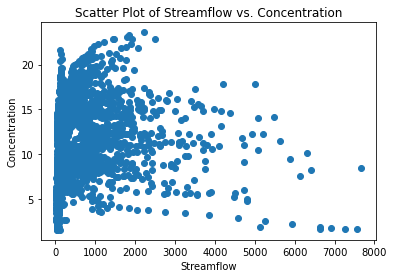
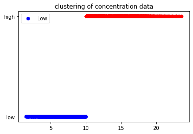

###  Website: <a href = "https://researchsam.github.io/slate/" /a>
### **BACKGROUND**

As the world population has grown rapidly, there has been a need for faster and newer technologies to feed the people. One way to increase agricultural yield is to use nitrogen fertilizers. However, recent studies have shown that most of the nitrogen fertilizer applied to fields leaches into surface water bodies, causing pollution. Therefore, it is important to quantify the amount of nitrate load that leaches into surface water bodies.


This is important because nitrate pollution can have a number of negative impacts on human health and the environment. For example, nitrate pollution can contaminate drinking water, leading to health problems such as methemoglobinemia (blue baby syndrome) in infants. Nitrate pollution can also harm aquatic ecosystems, leading to algae blooms and fish kills.


Quantifying the amount on nitrate that leaches into surface water bodies will help policymakers, scientists, and the general public. Policymakers can use this information to make decisions about agricultural practices and water quality regulations. Scientists can use this information to study the impacts of nitrate pollution on human health and the environment. The general public can use this information to make informed decisions about their own health and the health of their environment.


### Water Pollution 


**Figure 1** shows nitrate being deliverd into surface water through drain pipes


**Figure 2** shows the loss of auqtic life as a result of nitrate pollution


**Figure 3** Direct drinking from surface water


* * *
# **ANALYSIS**
Measuring nitrate concentration is very expensive and labor intensive so there are very little gauges that measure nitrate concentration across the state of Iowa, therefore this analysis seeks to investigate this factors affecting nitrate concentration in a region rich in data. The results of this analysis will use the relationship between contributing factors help predict nitrate concentration in areas where there no gauges.


### Factors contributing to nitrate pollution to surface water bodies
*   Nitrogen surplus
*   Precipitation
*   Streamflow


## Correlation between streamflow and concentration 
To understand the relationship between streamflow and nitrogen concentration, we calculate the correlation between these two parameters

```js
// Python code calculating correlation between streamflow and Nitrate concentration at north racoon river at Sac city.
correlation = np.corrcoef(flow["streamflow"], concentration["nitrate"])[0, 1]
print("The correlation coefficient between streamflow and concentration is", correlation)
```
The correlation coefficient between streamflow and concentration is 0.08838032193146401

### Interpretation
A correlation coefficient of 0.088 is very weak, so it is unlikely that linear regression would be able to accurately predict concentration from streamflow.

### Visual Representation


The coefficient of determination (R2) is 0.007811081304709219


* * *
# **DISCUSSION**

### Generally weak relationship between all combinations

* Correlation does not equal causation

## Natural events uncertainties

### Handling missing data

* Dropping missing rows might impact results significantly
* Larger sample set needed to take average


### Flow irregularities

* Baseflow and quickflow can significantly affect timing and transport of nitrate


### Point source contribution

* Investigation of drainage area for potential industry exporting nitrate waste


## GROUPING INTO HIGH AND LOW CONCENTRATION


### The high spots are locations that have nitrate concentration greater than 10mg/L. This is usefull to easily indentify hotspot areas for decision/policy makers to takle instead of analyzing the entire locations again, this process is important as it saves time in reusability of the code. 


* * *
# **Conclusions**
* Based on these analysis, there is no direct relationship between streamflow, concentration, precipitaton and nitrogen surplus, this can be due to many factors:
  1. Natural events like nitrogen breakdown or nutrient transport undergo several processes and therefore further investigation needs to be done to understand these relationships before anlyzing them. 
    - An example is instead of analyzing total streamflow, it would be best to separate the flow into a quickly responding part and slowly responding part. The quickly responding aspect of the flow that follows immediately after precipitation, this flow is runoff and tile drainage flow and the slowly responding part is baseflow that responds very slowly ater precipitation ( This means it can take couple of months or years before it drains to the surface water)  

* This also shows why it is improtant for agricultural engineers/scientist/researchers to understand data science and machine learning so that we can provide meaningful insights to model outputs/results.
 

* * *
# **Future Directions**
* Investigate factors that influence nutrient transport from agricultural lands to surface water bodies
    -Examples are, tile drainage, point sources contribution.
    
* Redo analysis for specific period of the year instead of monthly and yearly average
    - Periods after fertilizer application, periods after harvesting.


* * *
# The data and python code used for this analysis as well as the website used to display these findings can be downloaded in either tar or zip formats at the top of the page. 
### Python code can easily be replicated if you have streamflow, concenration, precipitation and nitrogen surplus data.


